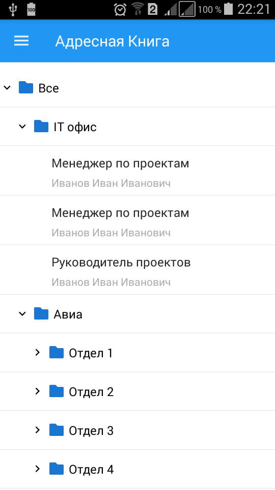

# AddressBook
AddressBook AddressBook - is a simple app for parsing a tree and showing it with U2020 carcass.

Screenshots
-------------

 

Libraries
---------

 * Dagger - http://square.github.io/dagger
 * ButterKnife - http://jakewharton.github.io/butterknife
 * Retrofit - http://square.github.io/retrofit
 * Moshi - https://github.com/square/moshi
 * Picasso - http://square.github.io/picasso
 * OkHttp - http://square.github.io/okhttp
 * RxJava - https://github.com/ReactiveX/RxJava
 * Timber - http://github.com/JakeWharton/timber
 * Madge - http://github.com/JakeWharton/madge
 * ProcessPhoenix - https://github.com/JakeWharton/ProcessPhoenix
 * Scalpel - http://github.com/JakeWharton/scalpel
 * LeakCanary - http://github.com/square/leakcanary
 * Telescope - https://github.com/mattprecious/telescope

# References (special thanks)
- [Uncle Bob: The Clean Architecture](https://blog.8thlight.com/uncle-bob/2012/08/13/the-clean-architecture.html) by Uncle Bob
- [The Repository pattern](https://msdn.microsoft.com/en-us/library/ff649690.aspx) by Microsoft
- [Effective Android UI](https://github.com/pedrovgs/EffectiveAndroidUI) by Pedro Gomez
- [Android Clean Architecture](https://github.com/android10/Android-CleanArchitecture) by Fernando Cejas
- [U2020](https://github.com/JakeWharton/u2020) by Jake Wharton
- [Android-architecture](https://github.com/behzodbek/Android-architecture) by Behzodbek Qodirov

